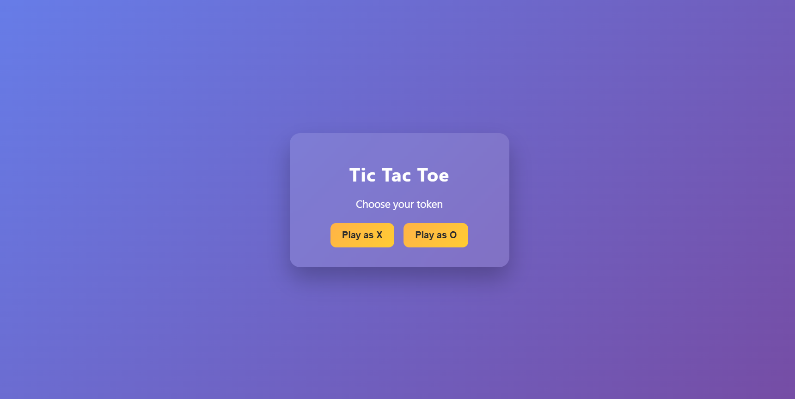
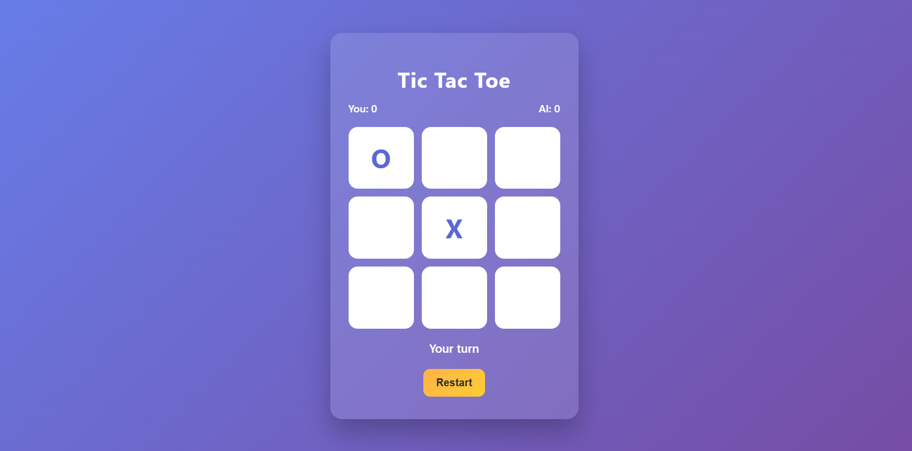
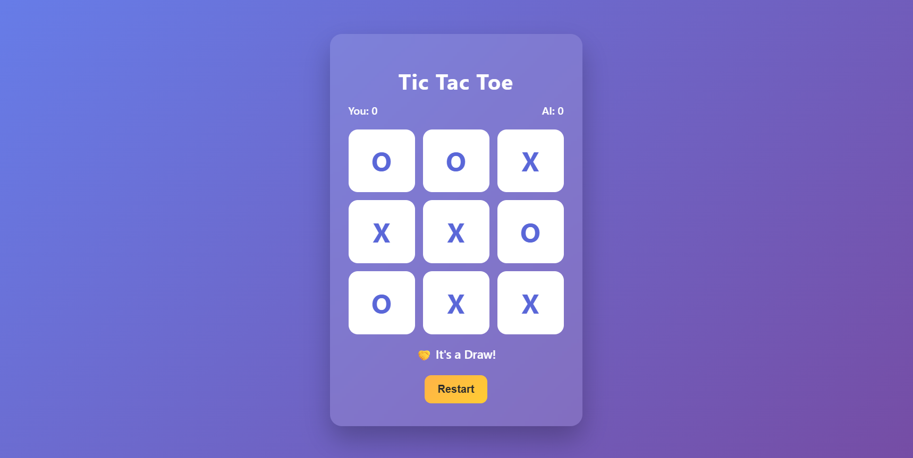

**Tic Tac Toe – AI Powered Web Game**

This is a web-based Tic Tac Toe game with an AI opponent, built using Flask, HTML, CSS, and JavaScript.
The AI uses the Minimax algorithm to make optimal decisions, making it impossible to defeat.

This project demonstrates the integration of artificial intelligence concepts with web development.

**# Features**
- Play Tic Tac Toe against an AI opponent
- Choose to play as X or O
- AI makes optimal moves using the Minimax algorithm
- Displays real-time game status (win, lose, or draw)
- Includes a scoreboard for Player vs AI
- Restart the game anytime
- Clean and responsive user interface

**# Technologies Used**
- Python
- Flask
- HTML
- CSS
- JavaScript
- Minimax Algorithm

**# Project Structure**

Tic-Tac-Toe/
- app.py
- Requirements.txt
- readme.md
- static/
  - style.css
- templates/
  - index.html
- screenshots/
  - home.png
  - gameplay.png
  - result.png

**# How to Run the Project**
Step 1: Clone the Repository
git clone https://github.com/your-username/tic-tac-toe-ai.git
cd tic-tac-toe-ai

Step 2: Install Dependencies
pip install -r Requirements.txt

Step 3: Run the Application
python app.py

Step 4: Open in Browser
http://127.0.0.1:5000/

**# Screenshots**

**## Home Screen**

**## Gameplay**

**## Result Screen**

**# How AI Works**

The AI uses the Minimax algorithm, which evaluates all possible moves and selects the one that maximizes its chances of winning while minimizing the opponent’s chances.

AI win → score +1
Human win → score -1
Draw → score 0

Based on these scores, the AI always chooses the best possible move.

**# Future Improvements**
- Add difficulty levels
- Implement multiplayer mode
- Improve mobile responsiveness
- Add sound effects
- Save match history or score
